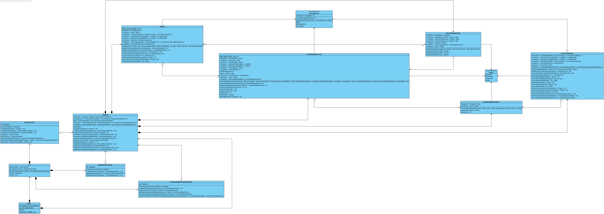
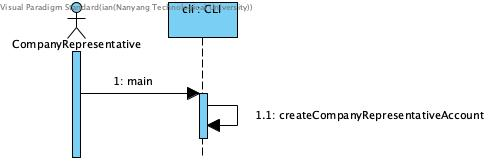
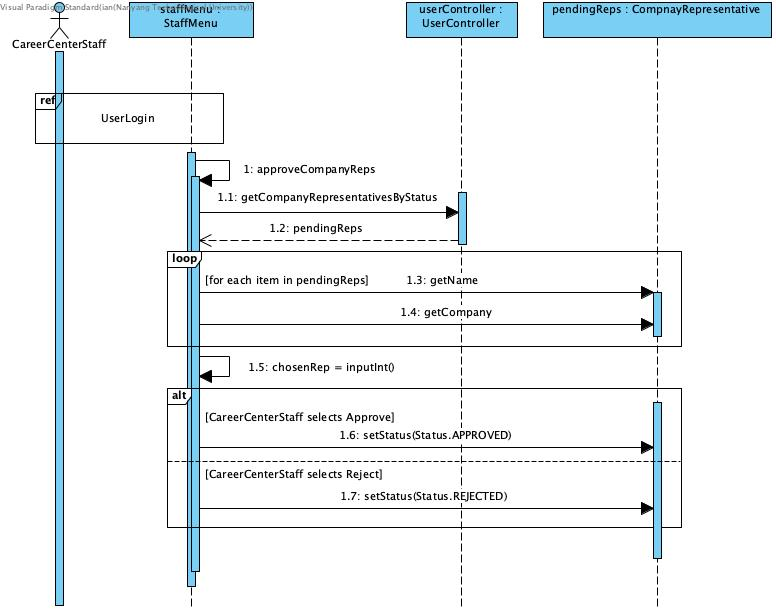
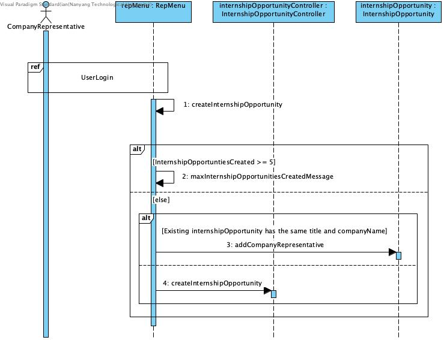
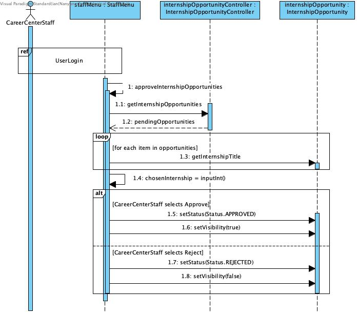
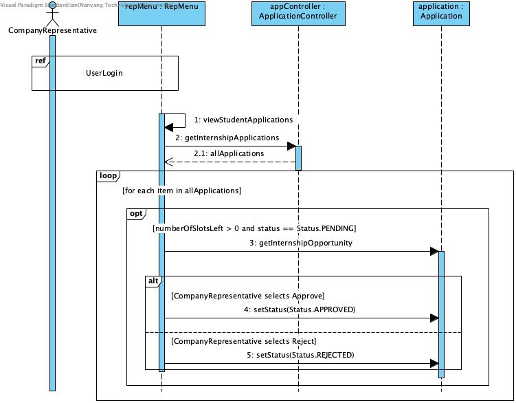
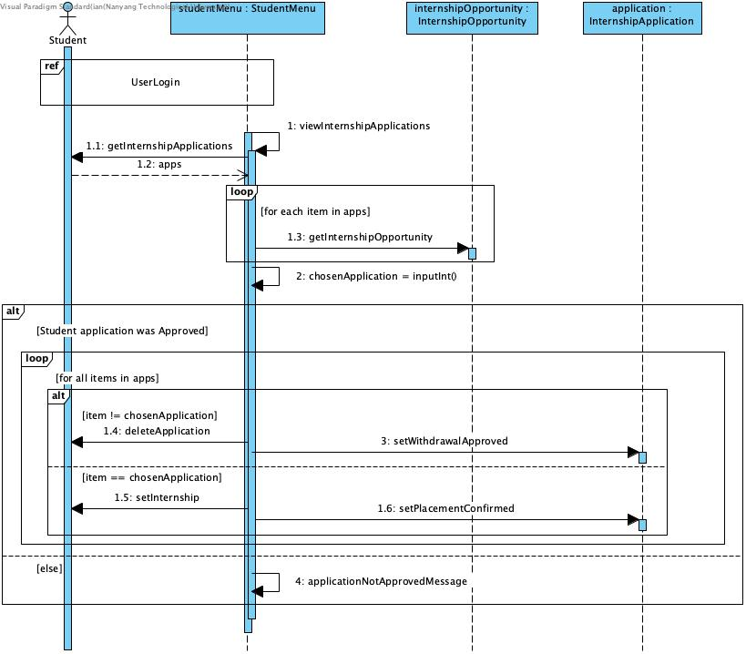
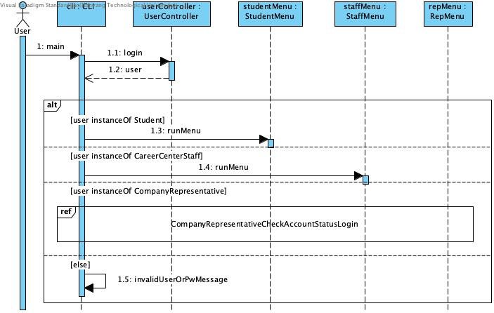
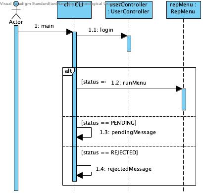

# SC2002

[Javadoc](https://casperchew.github.io/SC2002/)

## Diagrams

### Class Diagram



### Sequence Diagrams

The sequence Diagrams here display the flow of the app: from company representative applying for an account to student accepting his placement offer. To make our diagrams more understandable, we decided to split it up into smaller, more digestable parts.

#### 1. Company Representative creating account



#### 2. Career Center Staff approves Company Representative account



#### 3. Company Representative creates Internship Opportunity



#### 4. Career Center Staff approves Internship Opportunity



#### 5. Student applies for Internship Opportunity


_note_: the filtering of internship opportunities are via a stream:

```
List<InternshipOpportunity> internshipOpportunities = internshipOpportunityController.getInternshipOpportunitiesByStudent(student).stream()
    .filter(x -> student.getInternshipLevelFilter().isEmpty() || student.getInternshipLevelFilter().contains(x.getInternshipLevel()))
    .filter(x -> student.getCompanyNameFilter().isEmpty() || student.getCompanyNameFilter().contains(x.getCompanyName()))
    .filter(x -> x.getApplicationOpeningDate().isAfter(student.getApplicationOpeningDateFilter()))
    .filter(x -> x.getApplicationClosingDate().isBefore(student.getApplicationClosingDateFilter()))
    .filter(x -> Objects.equals(x.getStatus(), Status.APPROVED))
    .collect(Collectors.toList());
```

#### 6. Company Representative approves student application



#### 7. Student confirms placement



_note_: Once a student accepts the placement, the other applications will be deleted from his instance. However, these deleted applications will remain in the Database class, with withdrawalApproved set to true. This means that their application will remain for the Career Center Staff to view, if they need to. However, the application for the internship opportunity which they have accepted will remain, allowing him to send a withdrawal request if they wish to do so.

#### ref: UserLogin
User logging in



#### ref: CompanyRepresentativeCheckAccountStatusLogin
Company Representative checking account status and logging in



## TEST CASES:

## Student

### Applying for internship

- log in as ccstaff -> approve all internshipOpportunities -> logout -> login as a student -> select Apply for internship -> select internship opportunity -> apply for it -> logout -> login as ccstaff -> select View all internship applications -> check if the students application is displayed properly.

### View internship applications

- log in as ccstaff -> approve all internshipOpportunities -> logout -> login as a student -> select Apply for internship -> select a few internship opportunity -> apply for it -> exit that menu -> select View internship applications -> check if the applications are correctly displayed -> select each application -> check if information of each application is correct.

### Filtering internship opportunities

- log in as ccstaff -> approve all internshipOpportunities -> logout -> login as a student -> select Apply for internship -> take note of the displayed internship opportunities -> exit -> select Set filters -> set some filters (e.g. set company name filter to TechCorp) -> exit -> select Apply for internship -> ensure that the displayed internship opportunities are correct based on the filters set.

- login as a student -> select Set filters -> set some filters and take note of them -> exit -> logout -> log back in as the same student -> select Set filters -> check that the filters did not change.

### Changing password

- login as a student -> select Change password -> set password to "newPassword" -> logout -> attempt to login with the old password "password" -> attempt to login with the new password "newPassword" -> ensure that you can successfully login with the new password "newPassword".

## Company Representative

### Creating Internship Opportunities

- create company representative account -> login as career staff -> approve company representative account -> logout -> login as company representative -> input title -> input full internship details if internship opportunity does not yet exist.

### Viewing Created Internship Opportunities

- create 2 internship opportunities as company representative A -> logout -> login as career center staff -> approve both internship opportunities -> logout -> login as company representative A again -> view internship opportunities -> select 1 internship opportunity -> toggle visibility.

### Viewing Student Applications

- login as company representative A -> create 1 internship opportunity of basic level & preferred major of Computer Science -> create 1 internship opportunity of advanced level & preferred major of Computer Engineering -> logout -> login as career staff -> approve both newly created internships -> logout -> login as Tan Wei Ling -> apply for internship 1 -> logout -> login as Lim Yi Xuan -> apply for internship 2 -> logout -> login as company representative A -> accept internship application 1 & decline the other.

### Changing Passwords

- Create & approve account for company representative -> login as company representative -> change password -> login with user ID & new password.

## Career Center Staff

### Approving Company rep

- create 2 companyRep accounts -> log in as a ccstaff -> approve one companyRep and reject the other -> logout -> try logging in to both accounts.

### Approving internship opportunity

- log in as ccstaff -> approve 'Software Developer Intern' and reject 'Front-End Web Development Intern' -> log in as Tan Wei Ling -> apply for internship -> ensure that 'Software Developer Intern' is displayed and 'Front-End Web Development Intern' is not displayed.

### Withdrawal request

- log in as ccstaff -> approve all internshipOpportunities -> logout -> login as a student -> apply for internship -> send withdrawal request -> logout -> login as ccstaff -> approve/reject withdrawal request -> logout -> login as student -> check if withdrawal request was rejected or approved.

- log in as ccstaff -> approve all internshipOpportunities -> logout -> login as a student -> apply for internship -> logout -> login as the respective company rep -> approve the student application -> logout -> login as the student -> accept the internship opportunity (i.e. confirm placement) -> send withdrawal request for that very internship opportunity -> logout -> login as ccstaff -> approve/reject withdrawal request -> logout -> login as student -> check if withdrawal request was rejected or approved.

### Filtering internship opportunities

- create a new company representative account (username: d, password: d, company d) -> log in as CCStaff "Mr. Tan Boon Kiat" with password "password" -> approve company representative "d" -> log out -> log in as "d" -> create internship opportunity with preferred major as "Computer Science" and internship level as ADVANCED -> log out -> log in as "Mr. Tan Boon Kiat" -> set company representative filter to "d", set preferred major as "Computer Science" and set internship level filter as ADVANCED (the rest of the fields don't matter) -> generate internship opportunity report -> ensure that only "d"'s opportunity is displayed.

### Generate Report

- log in as ccstaff -> select generate internship opportunity report -> select any internship -> check if report is properly generated.

## Test Cases

### User's capabilities

#### 1. All Users

##### 1.1. Login

Expected Behaviour: User should be able to access their dashboard based on their roles

Failure Indicators: User cannot log in or receive incorrect error messages

| Step | Description           | Input        |
| ---- | --------------------- | ------------ |
| 1    | Select "Login" option | 1            |
| 2    | Enter name            | Tan Wei Ling |
| 3    | Enter password        | password     |

Expected Behaviour: The cli should display

```
Logged in as Tan Wei Ling
...
```

##### 1.2. Logout

Expected Behaviour: User that is logged in should be able to log out

Failure Indicators: User cannot log out or recieve incorrect error messages

| Step | Description           | Input        |
| ---- | --------------------- | ------------ |
| 1    | Select "Login" option | 1            |
| 2    | Enter name            | Tan Wei Ling |
| 3    | Enter password        | password     |
| 4    | Log out               | 5            |

Expected Behaviour: The cli should display

```
Logging out...
...
```

##### 1.3. Change password

Expected Behaviour: User that is logged in should be able to change password

Failure Indicators: User cannot change password

| Step | Description                     | Input        |
| ---- | ------------------------------- | ------------ |
| 1    | Select "Login" option           | 1            |
| 2    | Enter name                      | Tan Wei Ling |
| 3    | Enter password                  | password     |
| 4    | Select "change password" option | 4            |
| 5    | Enter new password              | newpassword  |
| 6    | Select "Login" option           | 1            |
| 7    | Enter name                      | Tan Wei Ling |
| 8    | Enter password                  | newpassword  |

Expected Behaviour:

After step 5, the cli should display

```
Your new password has been set.
Please re-login with your new password.
...
```

After step 8, the cli should display

```
Logged in as Tan Wei Ling
...
```

#### 2. Student

##### 2.1. Automatic registration

##### 2.2. View internship opportunities (based on students profile and visibility)

Expected Behaviour: Student is only able to view appropriate internship opportunities

Failure Indicators: Student can view internship opportunities not applicable to themselves

| Step | Description                                                                                      | Input        |
| ---- | ------------------------------------------------------------------------------------------------ | ------------ |
| 1    | Create BASIC Internship Opportunity for Computer Science Majors (refer to 3.2) with title "test" |              |
| 2    | Approve created Internship Opportunity (refer to 4.3)                                            |              |
| 3    | Select "Login" option                                                                            | 1            |
| 4    | Enter name                                                                                       | Tan Wei Ling |
| 5    | Enter password                                                                                   | password     |
| 6    | Select "Apply for internship"                                                                    | 1            |

Expected Behaviour:

After step 6, the cli should display

```
1) test
...
```

##### 2.3. Apply for internship opportunity

Expected Behaviour: Student is only able to view appropriate internship opportunities

Failure Indicators: Student can view internship opportunities not applicable to themselves

| Step | Description                                                                                      | Input        |
| ---- | ------------------------------------------------------------------------------------------------ | ------------ |
| 1    | Create BASIC Internship Opportunity for Computer Science Majors (refer to 3.2) with title "test" |              |
| 2    | Approve created Internship Opportunity (refer to 4.3)                                            |              |
| 3    | Select "Login" option                                                                            | 1            |
| 4    | Enter name                                                                                       | Tan Wei Ling |
| 5    | Enter password                                                                                   | password     |
| 6    | Select "Apply for internship"                                                                    | 1            |
| 7    | Select "1) test"                                                                                 | 1            |
| 8    | Select "1) Apply for this internship."                                                           | 1            |
| 9    | Exit the menu                                                                                    | -1           |
| 10   | Select "2) View internship applications."                                                        | 2            |

Expected Behaviour:

After step 10, the cli should display

```
1) test
...
```

###### 2.3.1. Maximum 3 applications

| Step | Description                                                                                       | Input        |
| ---- | ------------------------------------------------------------------------------------------------- | ------------ |
| 1    | Create BASIC Internship Opportunity for Computer Science Majors (refer to 3.2) with title "test1" |              |
| 2    | Create BASIC Internship Opportunity for Computer Science Majors (refer to 3.2) with title "test2" |              |
| 3    | Create BASIC Internship Opportunity for Computer Science Majors (refer to 3.2) with title "test3" |              |
| 4    | Create BASIC Internship Opportunity for Computer Science Majors (refer to 3.2) with title "test4" |              |
| 5    | Approve created Internship Opportunities (refer to 4.3)                                           |              |
| 6    | Select "Login" option                                                                             | 1            |
| 7    | Enter name                                                                                        | Tan Wei Ling |
| 8    | Enter password                                                                                    | password     |
| 9    | Apply for "test1", "test2", "test3" and "test4" (repeat steps 6 to 10 of 2.3)                     |              |
| 10   | Apply for "test4" (refer to steps 6 to 10 of 2.3)                                                 |              |

Expected Behaviour:

After step 10, the cli should display

```
You already have 3 applications pending.
...
```

###### 2.3.2. `InternshipLevel` validation based on Student's `yearOfStudy`.

##### 2.4. View internship applications

###### 2.4.1. Default `PENDING` status

**Expected Behaviour:** Students in Year 1 or 2 should only be able to view and apply for `BASIC` level internships. Students in Year 3 and above should be able to view and apply for `BASIC`, `INTERMEDIATE`, and `ADVANCED` level internships.

**Failure Indicators:** A Year 1 or 2 student is able to view or apply for an `ADVANCED` or `INTERMEDIATE` internship, or a Year 3 student cannot view an `ADVANCED` internship.

| Step | Description | Input |
| :--- | :--- | :--- |
| 1 | Create `ADVANCED` Internship Opportunity (refer to 3.2) with title "SeniorDev" | |
| 2 | Approve created Internship Opportunity (refer to 4.3) | |
| 3 | Select "Login" option | 1 |
| 4 | Enter name (Year 1 Student) | Chong Zhi Hao |
| 5 | Enter password | password |
| 6 | Select "Apply for internship" | 1 |

**Expected Behaviour:**

After step 6, the cli should **NOT** display "SeniorDev" in the list of available internships.

| Step | Description | Input |
| :--- | :--- | :--- |
| 7 | Logout | 5 |
| 8 | Select "Login" option | 1 |
| 9 | Enter name (Year 3 Student) | Ng Jia Hao |
| 10 | Enter password | password |
| 11 | Select "1) Apply for internship." | 1 |

**Expected Behaviour:**

After step 11, the cli should display:

```
1) SeniorDev
...
```


##### 2.4. View internship applications

**Expected Behaviour:** The student should be able to view a list of all internship applications they have submitted. This list must display the current status of the application.

**Failure Indicators:** The list is empty after a successful application, or the application details (e.g., Company Name, Title) do not match the internship applied for.

| Step | Description | Input |
| :--- | :--- | :--- |
| 1 | Create BASIC Internship Opportunity (refer to 3.2) with title "Data Analyst" | |
| 2 | Approve created Internship Opportunity (refer to 4.3) | |
| 3 | Select "Login" option | 1 |
| 4 | Enter name | Tan Wei Ling |
| 5 | Enter password | password |
| 6 | Select "1) Apply for internship." | 1 |
| 7 | Select "1) Data Analyst" | 1 |
| 8 | Select "1) Apply for this internship." | 1 |
| 9 | Return to Student Menu (Exit application flow) | -1 |
| 10 | Select "View internship applications" | 2 |

**Expected Behaviour:**

After step 10, the CLI should display the application details:

```
Internship applications:

1) Data Analyst
...
```

###### 2.4.1. Default `PENDING` status

**Expected Behaviour:** When a student first applies for an internship, the status must automatically be set to `PENDING`. It should not be `APPROVED` or `REJECTED` until a career center staff acts on it.

**Failure Indicators:** The status is initialized as `APPROVED`, `REJECTED`, or `null`.

| Step | Description | Input |
| :--- | :--- | :--- |
| 1 | Perform steps 1 through 10 from Section 2.4 (View internship applications) | |
| 2 | Select "1) Data Analyst" to view details | 1 |

**Expected Behaviour:**

The console should verify the status:

```
...
Internship title: Data Analyst
Internship description: [DESCRIPTION]
Status: PENDING
Placement confirmed: false
Withdrawal requested: false
1) Accept placement.
2) Request withdrawal.
3) Exit.
Enter an option: 
```

##### 2.5. Accept internship placement

##### 2.5. Accept internship placement

**Expected Behaviour:** A student can accept an internship offer only if the application status is `APPROVED` (i.e., approved by the Company Representative). Upon acceptance, `placementConfirmed` is then set to `true`.

**Failure Indicators:** The student cannot accept a `APPROVED` offer, or `placementConfirmed` does not update to `true` after acceptance.

| Step | Description | Input |
| :--- | :--- | :--- |
| 1 | **Setup:** Ensure there is an application with `APPROVED` status for "Tan Wei Ling" (Requires Company Rep to approve an application, refer to 3.4) | |
| 2 | Select "Login" option | 1 |
| 3 | Enter name | Tan Wei Ling |
| 4 | Enter password | password |
| 5 | Select "2) View internship applications." | 2 |
| 6 | Select the `APPROVED` application | 1 |
| 7 | Select "Accept Offer" | 1 |

**Expected Behaviour:**

After step 7, the cli should display:

```
Congratulations! You have been hired.
...
```


###### 2.5.1. Only 1 can be accepted

**Expected Behaviour:** A student is restricted to holding only **one** confirmed internship placement. Once a placement is confirmed, the system must prevent the student from accepting any other offers.

**Failure Indicators:** The system allows a student to accept multiple `APPROVED` internship placements.

| Step | Description | Input |
| :--- | :--- | :--- |
| 1 | **Setup:** Ensure "Tan Wei Ling" has already accepted an internship (Status is `CONFIRMED`) | |
| 2 | **Setup:** Ensure "Tan Wei Ling" has another application that is `APPROVED` (Approved by Rep) | |
| 3 | Select "Login" option | 1 |
| 4 | Enter name | Tan Wei Ling |
| 5 | Enter password | password |
| 6 | Select "View internship applications" | 2 |
| 7 | Select the remaining `APPROVED` application | 2 |
| 8 | Attempt to "Accept Offer" | 1 |

**Expected Behaviour:**

The system should deny the action, or the option to accept should simply not be available (since the application should have been automatically withdrawn, see 2.5.2). If the option is still visible, selecting it should result in an error message:

```
You have already accepted an internship opportunity.
```

###### 2.5.2. Other applications will be withdrawn once an internship placement in accepted

**Expected Behaviour:** Automatically withdraw all other PENDING or APPROVED applications once the student accepts a specific internship offer. This releases slots for other students.

**Failure Indicators:** Other applications remain `PENDING` or `APPROVED` after the student confirms a placement.

| Step | Description | Input |
| :--- | :--- | :--- |
| 1 | **Setup:** Student applies for "Job A" and "Job B". | |
| 2 | **Setup:** Company Rep approves **BOTH** "Job A" and "Job B" (Status `APPROVED`). | |
| 3 | Login as Student | |
| 4 | Navigate to "Job A" and **Accept** it. | |
| 5 | Navigate back to "View internship applications". | 2 |
| 6 | Check the status of "Job B". | |

**Expected Behaviour:**

After step 6, if the student attempts to select "1) Apply for internship.", the CLI shall display:

```
...
You have already accepted an internship opportunity.

```

##### 2.6. Request internship application withdrawal subject to approval from `CareerCenterStaff`

###### 2.6.1. Before placement confirmation

**Expected behaviour:** Student will submit a withdrawal request to the `CareerCenterStaff`, subject to approval.

**Failure indicators:** The `InternshipApplication` object still has `Withdrawal requested: false` when the student views all internship applications.

| Step | Description | Input |
| :--- | :--- | :--- |
| 1 |"Setup: Ensure ""Tan Wei Ling"" has at least one PENDING or SUCCESSFUL application (but not yet Accepted/Confirmed)."
| 2 |"Select ""Login"" option" | 1
| 3 |Enter name | Tan Wei Ling
| 4 | Enter password |password |
| 5 | Select "View internship applications" | 2 |
| 6 | Select the application to withdraw (e.g., "1) Data Analyst") | 1 |
| 7 | Select "2) Request withdrawal" | 2 |
| 8 |Verify: Select the same application again to check status | 1 |

**Expected Behaviour:**

After step 8, the CLI shall display:

```
Internship title: [TITLE]
Internship description: [DESCRIPTION]
Status: PENDING
Total available slots: [NUMOFSLOTS]
Applicants accepted: [NUMOFAPPLICANTS]
Placement confimed: false
Withdrawal requested: true

```

## Database

The default password to all the users is `password`.

### Students

| StudentID | Name          | Major                           | Year | Email                 |
| --------- | ------------- | ------------------------------- | ---- | --------------------- |
| U2310001A | Tan Wei Ling  | Computer Science                | 2    | tan001@e.ntu.edu.sg   |
| U2310002B | Ng Jia Hao    | Data Science & AI               | 3    | ng002@e.ntu.edu.sg    |
| U2310003C | Lim Yi Xuan   | Computer Engineering            | 4    | lim003@e.ntu.edu.sg   |
| U2310004D | Chong Zhi Hao | Information Engineering & Media | 1    | chong004@e.ntu.edu.sg |
| U2310005E | Wong Shu Hui  | Computer Science                | 3    | wong005@e.ntu.edu.sg  |

### Company Representatives

There are no initial Company Representatives

### Career Center Staffs

| StaffID | Name              | Role                | Department | Email             |
| ------- | ----------------- | ------------------- | ---------- | ----------------- |
| sng001  | Dr. Sng Hui Lin   | Career Center Staff | CCDS       | sng001@ntu.edu.sg |
| tan002  | Mr. Tan Boon Kiat | Career Center Staff | CCDS       | tan002@ntu.edu.sg |
| lee003  | Ms. Lee Mei Ling  | Career Center Staff | CCDS       | lee003@ntu.edu.sg |

## OO concepts used

In this section, we will show some examples of OO concepts being used in our program.

### Inheritance

`Student.java`, `CompanyRepresentative.java` and `CareerCenterStaff.java` are all subclasses of the super class `User.java`

### Abstraction

Each user in `CLI.java` has their respective menu classes. For example, when the user logs in as a student, the main function of `CLI.java` will run

```
StudentMenu studentMenu = new StudentMenu(student, userController, appController, internshipController);
user = studentMenu.runMenu();
```

This hides and abstracts away the complex implementations of each menu class from the main CLI class.

### Encapsulation

Every entity class in our app has accessor and mutator methods. This keeps the underlying data of classes safe from outside meddling. Here is an example mutator method from `CompanyRepresentative.java`:

```
public String getCompany() {
        return company;
    }
```

### Polymorphism (this might need to be adjusted depending on how login() is changed)

This is an example of where polymorphism is used and can be found in `UserController.java`:

```
public User login(String userID, String passwordHash) {
    for (User user: getUsers()) {
        if (Objects.equals(userID, user.getUserID()) && Objects.equals(passwordHash, user.getPasswordHash())) {
            return user;
        }
    }

```

Different users have differently formatted UserIDs. Since the method body of `getUserID()` is dynamically binded during runtime, this allows the program to treat all these subclasses as a User while still preserving their specific behaviors. This keeps the `User.java` class and its subclasses maintainable and extensible.

## Coupling and cohesion

## Design princples used

In this section we will display some examples of the usage of the following design principles:

- Single Responsibility Principle
- Open-Closed Principle
- Liskov Substitution Principle
- Interface Segregation Principle
- Dependancy Inversion Principle
- Model-View-Controller Design Pattern

### Single Responsibility Principle

```
public class ApplicationController {
    private Database db;

    public ApplicationController(Database db) {
        this.db = db;
    }

    public ArrayList<InternshipApplication> getInternshipApplications() {
        return db.getInternshipApplications();
    }

    public void createApplication(InternshipApplication application) {
        db.createInternshipApplication(application);
    }

    public void deleteApplication(InternshipApplication application) {
        db.deleteInternshipApplication(application);
    }
```

The ApplicationController class only has one clearly defined responsibility: managing internship application operations (retrieving, creating, and deleting applications). This means it has only one reason to change. Because we used this design principle, we avoided having "God classes", which would make the code difficult to maintain, understand, and extend.

The `Utils` package allows for seamless processing of user input via easy-to-use functions across the entire app. With methods to read integers, strings, dates & methods to clear console output, it reduces the need to change multiple parts of the code whenever a fix or new feature has to be made. This, in turn, provides for high cohesion.

The usage of various menus, such as the main one from `CLI`, alongside specific menus for each type of user, minimises coupling as the menus each make calls to the various controllers, such as `RepMenu` accessing `InternshipController` to process data rather than accessing accessing the database or CSV files directly. This clearly separates user interface from data logic.

### Open-Closed Principle

```
public abstract class User {...}
```

The abstract class User follows the Open-Closed Principle because it provides a base structure that can be extended through subclasses (e.g., Student, CompanyRep, CCStaff) without modifying the existing User class. If a new user type needs to be added, such as PostGradStudent, it can be introduced without changing any existing code, simply by creating a new subclass like:

```
public PostGradStudent extends User {...}
```

This means that if new features or users were to be added in the future, it would be easy and safe to do so. This also reduced onboarding time, for people who started working on the project later, as they did not need to modify existing code which they might not be familiar with.

### Liskov Subsitution Principle

The main function of CLI uses methods defined in the User superclass, for example:

```
Utils.clear();
System.out.println("Logged in as " + user.getName());
System.out.println();
```

These statements rely only on behavior defined in User. This means that regardless of whether the logged-in user is a Student, CompanyRepresentative, or CareerCenterStaff, the program continues to function correctly. Because each subclass can be used anywhere a User is expected without altering the correctness of the program, the design adheres to the Liskov Substitution Principle.

### Interface Segregation Principle

The menu is separated into 4 main components - 1 main CLI, & 1 menu each for company representatives, staff & students respectively. Each menu contains only the minimal methods & tools required for the targeted user, thereby avoiding the worst-case scenario whereby eery method is clustered inefficiently in a single CLI file.

Moreover, instead of using a monolithic User class as a general class for all users, we utilised a `User` superclass, while branching out into subclasses for `CareerCenterStaff`, `CompanyRepresentative` & `Student`. The base class `User` only defines common authentication methods shared by all, while each subclass implements specific behaviours that are only related to them.

All these steps have been taken to ensure that no class depends on methods that it does not use.

### Dependancy Inversion Principle

At the start of the main function of CLI, we have:

```
User user = null;
...
user = userController.login(name, password);
```

This means that the high-level module CLI does not depend directly on low-level modules such as Student, CompanyRepresentative, or CareerCenterStaff. Instead, it relies on the abstract User class, which defines the interface and behavior expected from all user types. Furthermore, the abstraction User does not implement methods specific to any subclass, such as `getInternshipApplications()`. This ensures that the high-level module (CLI) and the abstraction (User) do not depend on low-level modules (Student, CompanyRepresentative, CareerCenterStaff). Instead, the low-level modules depends on and implements behaviors based on the User abstraction. This reversal of dependency ensures flexibility and maintainability, allowing new types of users to be added without modifying the CLI or other high-level modules.

### Model-View-Controller

We separated an our classes into three main groups:

- Models – These are the entity classes that represent the data of the application. Examples include:

  - `Student.java`
  - `CompanyRepresentative.java`
  - `CareerCenterStaff.java`

- View - These classes handle the presentation layer and user interaction. They display information to the user and capture input. Examples include:

  - `CLI.java`
  - `StudentMenu.java`
  - `RepMenu.java`
  - `StaffMenu.java`

- Controller - These classes act as intermediaries between the models and views. They provide create, read and delete functionalities for the view classes. Examples include:
  - `ApplicationController.java`
  - `InternshipController.java`
  - `InternshipOpportunityController.java`

By organizing the system into models, views, and controllers, we achieve a clear separation of concerns. This makes the code easier to maintain, extend, and test. Changes in the user interface do not affect the data or business logic, and modifications to the underlying data model do not require changes in the presentation layer.

## Reflection

### Trade offs and decisions made

At the start, we were conflicted on whether we would want to utilize the Single Responsibility Principle. This was because we initially thought that the project would be a small one, and that limiting each class to a single responsibility would lead to us having many "bloat" classes and files. We understood that there was a trade off to be made: either we have fewer classes and files OR we have neater and more maintainable code. In the end, we decided on the latter, which was a valuable decision in hindsight. At the beginning, we underestimated the scale of this app, and had we decided not to use to Single Responsibility Principle, we would have ended up with code that would be impossible to extend and maintain.

### Difficulties encountered

Initially, implementing controller classes was a huge difficulty. This was because each controller needed to communicate with each other, and we found that they had very messy associations. This made instantiating controllers very confusing and made our code unreadable. Because of this, we realized we needed to keep our code loosely coupled and cohesive. With this in mind, we decided to create a class called `Database.java`, which held all the data and for each controller class, it would only talk to `Database.java`. This hugely simplified our code and as now each controller had a clear responsibility: interact with Database to access or modify data.

### Further improvements and features

Currently, the filtering system is very difficult to use because the program is ran on the command line. If this project were to live on, we would upgrade to a GUI and keep most of our current Java code as the backend. We would adopt a Client-Server architecture, where the frontend (client) handles user interaction and presentation, and the backend (server) manages data, business logic, and communication with the database.

Furthermore, because our system is modular, we can easily swap out Database.java for an actual database that can store persistant data. This means our system is scalable and can accomodate more users easily.

Lastly, the use of the Open-Closed Principle means that we can easily add different types of users and features to the system. For example, we could have options for graduate students by extending the student abstract class and using the UniStudent interface.

### Lessons learnt

Before starting this project, we were skeptical of the SOLID design principles. Because we had only worked on small scale projects in the past, they felt convoluted and unnecessarily complicated. Although, we initially decided to use SOLID so that we would be graded higher, towards the end of the project, we started to understand the importance of these principles. It kept our code easy to extend and understand, so that the new features could be added easily and quickly.

Had we decided to be smart, and dump everything into Main.java, we would likely not have met the deadline...
